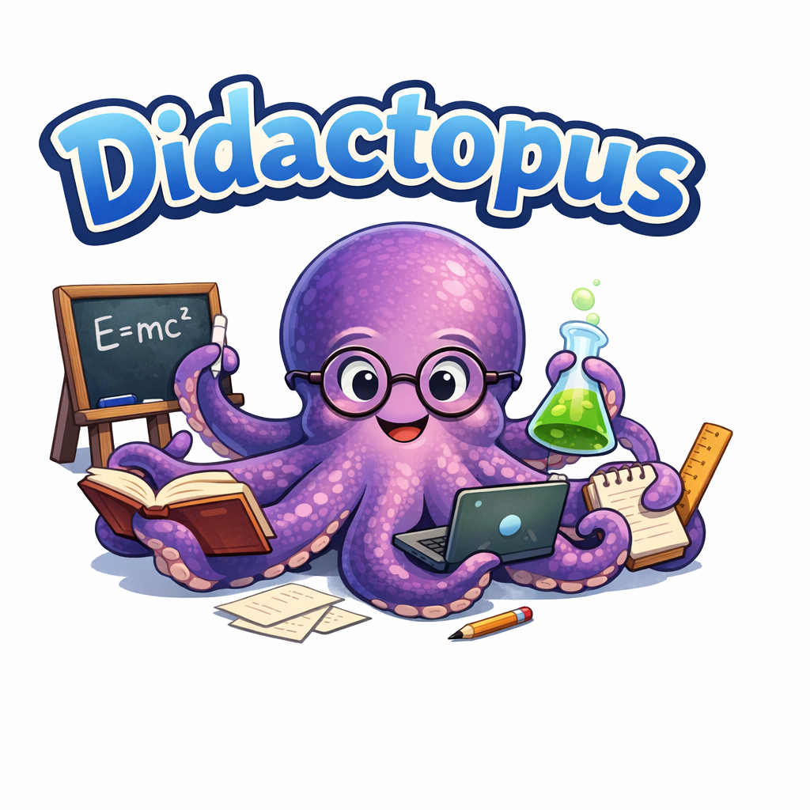

# Didactopus



Didactopus is a local-first Python codebase for turning educational source material into structured learning domains, evaluating learner progress against those domains, and exporting review, mastery, and skill artifacts.

Its intended use is closer to a structured mentor or self-study workbench than a "do my assignment for me" engine. The project should help learners get guidance, sequencing, feedback, and explanation without encouraging the offloading effect that comes from unstructured GenAI use.

At a high level, the repository does five things:

1. Ingest source material such as Markdown, text, HTML, PDF-ish text, DOCX-ish text, and PPTX-ish text into normalized course/topic structures.
2. Distill those structures into draft domain packs with concepts, prerequisites, roadmaps, projects, attribution, and review flags.
3. Validate, review, and promote those draft packs through a workspace-backed review flow.
4. Build merged learning graphs, rank next concepts, accumulate learner evidence, and export capability profiles.
5. Demonstrate end-to-end flows, including an MIT OCW Information and Entropy demo that produces a pack, learner outputs, a reusable skill bundle, and progress visualizations.

## Start Here If You Just Want To Learn

If you only want the shortest path to "show me Didactopus helping someone learn," run:

```bash
pip install -e .
python -m didactopus.ocw_information_entropy_demo
python -m didactopus.ocw_progress_viz
python -m didactopus.ocw_skill_agent_demo
```

Then open:

- `examples/ocw-information-entropy-run/learner_progress.html`
- `examples/ocw-information-entropy-skill-demo/skill_demo.md`
- `skills/ocw-information-entropy-agent/`

That gives you:

- a generated topic pack
- a visible learning path
- progress artifacts
- a reusable skill grounded in the exported knowledge

The point is not to replace your effort. The point is to give your effort structure, feedback, and momentum.

If that is your use case, read the next section, `Fast Start For Impatient Autodidacts`, and skip the deeper architecture sections until you need them.

## Fast Start For Impatient Autodidacts

If your real question is "How quickly can I get this to help me learn something?", use one of these paths.

### Fastest path: use the included MIT OCW demo

This is the shortest route to seeing the whole system work as a personal mentor scaffold.

1. Install the repo:

```bash
pip install -e .
```

2. Generate the demo pack, learner outputs, and reusable skill:

```bash
python -m didactopus.ocw_information_entropy_demo
```

3. Render the learner progress views:

```bash
python -m didactopus.ocw_progress_viz
python -m didactopus.ocw_progress_viz --full-map
```

4. Run the "agent uses the learned skill" demo:

```bash
python -m didactopus.ocw_skill_agent_demo
```

After that, inspect:

- `examples/ocw-information-entropy-run/`
- `examples/ocw-information-entropy-skill-demo/`
- `skills/ocw-information-entropy-agent/`

What you get:

- a domain pack for the topic
- a guided curriculum path
- a synthetic learner run over that path
- a capability export
- a reusable skill bundle
- visual progress artifacts

This is the best "show me why this is fun" path in the current repo.

### Fast custom path: turn one markdown file into a draft learning domain

If you already have notes, a syllabus, or a course outline, the lightest custom workflow is:

1. Put the material in a Markdown or text file.
2. Adapt and ingest it through the course/topic pipeline.
3. Emit a draft pack.
4. Review only what matters.

The easiest reference for this flow is the OCW demo source:

- `examples/ocw-information-entropy/6-050j-information-and-entropy.md`

Use it as a template for your own topic, then follow the same pattern implemented in:

- `didactopus.ocw_information_entropy_demo`

### If you want a mentor more than a curation tool

Treat Didactopus as a loop:

1. Start from one topic you genuinely care about.
2. Generate a draft pack quickly, even if it is imperfect.
3. Keep only the concepts and progression that feel useful.
4. Use the resulting pack and skill outputs to drive explanations, study plans, and self-checks.

The important idea is not "perfect ingestion first." It is "usable learning structure fast enough that you keep going."

### If you are using it alongside coursework

The intended pattern is:

1. Use Didactopus to clarify the topic map and prerequisites.
2. Ask it for hints, sequencing, comparisons, and self-check prompts.
3. Use its outputs to diagnose where you are weak.
4. Still do the actual writing, solving, and explaining yourself.

That is the difference between assisted learning and offloading. Didactopus should help you think better, not quietly substitute for your thinking.

### Current friction honestly stated

The lowest-friction path is the included demo. The custom path still asks you to be comfortable with:

- running Python commands locally
- editing or preparing a source file
- accepting heuristic extraction noise
- reviewing draft outputs before trusting them

Didactopus is already good at reducing the activation energy from "pile of source material" to "coherent learning structure," but it is not yet a one-click end-user tutor product.

### Why use it anyway?

Because it can make learning feel more like building a visible map of mastery than passively consuming material.

Instead of only reading notes, you can get:

- a concept graph
- a staged path
- explicit prerequisites
- evidence-aware progress artifacts
- reusable skill outputs for future tutoring or evaluation

In the best case, that makes learning feel more like active skill-building and less like either passive consumption or answer outsourcing.

## What Is In This Repository

- `src/didactopus/`
  The application and library code.
- `tests/`
  The automated test suite.
- `domain-packs/`
  Example and generated domain packs.
- `examples/`
  Sample source inputs and generated outputs.
- `skills/`
  Repo-local skill bundles generated from knowledge products.
- `webui/`
  A local review/workbench frontend scaffold.
- `docs/`
  Focused design and workflow notes.

## Core Workflows

### 1. Course and topic ingestion

The ingestion path converts source documents into `NormalizedDocument`, `NormalizedCourse`, and `TopicBundle` objects, then emits a draft pack.

Main modules:

- `didactopus.document_adapters`
- `didactopus.course_ingest`
- `didactopus.topic_ingest`
- `didactopus.rule_policy`
- `didactopus.pack_emitter`

Primary outputs:

- `pack.yaml`
- `concepts.yaml`
- `roadmap.yaml`
- `projects.yaml`
- `rubrics.yaml`
- `review_report.md`
- `conflict_report.md`
- `license_attribution.json`

### 2. Review and workspace management

Draft packs can be brought into review workspaces, edited, and promoted to reviewed packs.

Main modules:

- `didactopus.review_schema`
- `didactopus.review_loader`
- `didactopus.review_actions`
- `didactopus.review_export`
- `didactopus.workspace_manager`
- `didactopus.review_bridge`
- `didactopus.review_bridge_server`

Key capabilities:

- create and list workspaces
- preview draft-pack imports
- import draft packs with overwrite checks
- save review actions
- export promoted packs
- export `review_data.json` for the frontend

### 3. Learning graph and planning

Validated packs can be merged into a namespaced DAG, including explicit overrides and stage/project catalogs.

Main modules:

- `didactopus.artifact_registry`
- `didactopus.learning_graph`
- `didactopus.graph_builder`
- `didactopus.concept_graph`
- `didactopus.planner`
- `didactopus.adaptive_engine`

Key capabilities:

- dependency validation for packs
- merged prerequisite DAG construction
- roadmap generation from merged stages
- graph-aware next-concept ranking
- adaptive plan generation from current mastery

### 4. Evidence, mastery, and capability export

Learner progress is represented as evidence summaries plus exported capability artifacts.

Main modules:

- `didactopus.evidence_engine`
- `didactopus.evaluator_pipeline`
- `didactopus.progression_engine`
- `didactopus.mastery_ledger`
- `didactopus.knowledge_export`

Key capabilities:

- weighted evidence ingestion
- confidence estimation
- multidimensional mastery checks
- resurfacing weak concepts
- capability profile JSON export
- markdown capability reports
- artifact manifests

### 5. Agentic learner demos and visualization

The repository includes deterministic agentic demos rather than a live external model integration.

Main modules:

- `didactopus.agentic_loop`
- `didactopus.ocw_information_entropy_demo`
- `didactopus.ocw_progress_viz`

Generated demo artifacts:

- `domain-packs/mit-ocw-information-entropy/`
- `examples/ocw-information-entropy-run/`
- `skills/ocw-information-entropy-agent/`

## Quick Start

### Install

```bash
pip install -e .
```

### Run tests

```bash
pytest
```

### Generate the MIT OCW demo pack, learner outputs, and skill bundle

```bash
python -m didactopus.ocw_information_entropy_demo
```

This writes:

- `domain-packs/mit-ocw-information-entropy/`
- `examples/ocw-information-entropy-run/`
- `skills/ocw-information-entropy-agent/`

### Render learner progress visualizations

Path-focused view:

```bash
python -m didactopus.ocw_progress_viz
```

Full concept map including noisy non-path concepts:

```bash
python -m didactopus.ocw_progress_viz --full-map
```

### Run the review bridge server

```bash
python -m didactopus.review_bridge_server
```

The default config file is `configs/config.example.yaml`.

## Current State

This repository is functional, but parts of it remain intentionally heuristic.

What is solid:

- pack validation and dependency checks
- review-state export and workspace import flow
- merged learning graph construction
- weighted evidence and capability exports
- deterministic agentic demo runs
- generated skill bundles and progress visualizations

What remains heuristic or lightweight:

- document adapters for binary formats are simplified text adapters
- concept extraction can produce noisy candidate terms
- evaluator outputs are heuristic rather than formal assessments
- the agentic learner loop uses synthetic attempts
- the frontend and bridge flow are local-first scaffolds, not a hosted product

## Recommended Reading

- [docs/course-to-pack.md](docs/course-to-pack.md)
- [docs/learning-graph.md](docs/learning-graph.md)
- [docs/agentic-learner-loop.md](docs/agentic-learner-loop.md)
- [docs/mastery-ledger.md](docs/mastery-ledger.md)
- [docs/workspace-manager.md](docs/workspace-manager.md)
- [docs/interactive-review-ui.md](docs/interactive-review-ui.md)
- [docs/faq.md](docs/faq.md)

## MIT OCW Demo Notes

The MIT OCW Information and Entropy demo is grounded in the MIT OpenCourseWare course page and selected unit/readings metadata, then converted into a local course source file for reproducible ingestion. The resulting generated pack and learner outputs are intentionally reviewable rather than presented as authoritative course mirrors.
